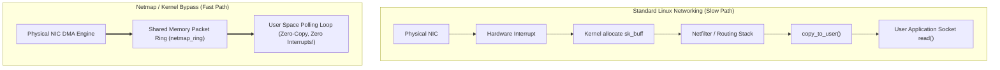

# Kernel-Bypass & Sub-Microsecond I/O

> [!summary]
> Research papers that eliminated the operating system bottleneck in high-speed networking: Matthew Grosvenor's study of nanosecond network jitter, Luigi Rizzo's Netmap zero-copy framework, Stanford's IX dataplane OS, the RAMCloud sub-10-microsecond RPC thesis, and DaRPC RDMA subsystems.

---

## 1. Jumpstarting the Network: Sub-Microsecond Jitter (Grosvenor et al., 2015)

### Cambridge University / Low-Latency Systems Research
Published in *USENIX NSDI*, Grosvenor et al. deployed nanosecond-precision hardware taps to dissect network latency in financial trading environments and modern cloud datacenters.

```text
The Anatomy of a Microsecond Latency Spike:
Average Packet Travel Time across a Switch: ~400–700 nanoseconds.
Typical OS Interrupt Service Routine (ISR) Delay: ~2,500–5,000 nanoseconds!
Conclusion: The operating system kernel introduces 5x to 10x more latency and jitter
than the entire physical network fabric combined!
```

### Jitter Sources Uncovered
1. **PCIe Bus Latency & MSI-X Interrupt Delivery**:
   - Packets arriving at the NIC trigger an interrupt; the interrupt controller halts the CPU pipeline and switches execution context, injecting unpredictable tail latency (jitter).
2. **Kernel Socket Buffer Copying (`sk_buff`)**:
   - The OS kernel copies data from kernel packet descriptors into user-space buffers (`read()` / `recv()`), generating multiple L3/DRAM cache misses per packet.
3. **Queueing at Output Buffers**:
   - Even small queue depths (e.g., 5–10 packets waiting in a buffer) introduce 500+ ns of packet serialization delay.

---

## 2. Netmap: Fast Packet I/O (Luigi Rizzo, 2012)

### Architectural Shift: Kernel Bypass
Luigi Rizzo's paper in *USENIX ATC* established the foundational architecture that led to **DPDK (Data Plane Development Kit)** and Linux **AF_XDP**:



### Key Principles of Netmap
1. **Zero-Copy Shared Memory**: Memory-maps the NIC's circular RX and TX descriptor rings directly into the application process address space via `mmap()`.
2. **Batching**: A single `ioctl()` or user-space poll flushes up to hundreds of packets simultaneously, amortizing system call overhead to near-zero.
3. **Throughput Impact**: Increased packet generation on commodity single-core hardware from 1.2 million packets/sec (Linux standard) to **14.88 million packets/sec (10 GbE line rate)**!

---

## 3. IX: A Protected Dataplane Operating System (Adam Belay et al., 2014)

### The OSDI 2014 Breakthrough
Adam Belay and the Stanford team resolved the fundamental trade-off between **safety** and **ultra-low latency**:
- Kernel bypass frameworks (DPDK) provide raw speed but sacrifice security: An untrusted or buggy user process can crash the host or read other processes' raw network packets.
- **IX Architecture**: Utilizes Intel VT-x hardware virtualization to run a specialized **Dataplane OS** alongside Linux:
  - Linux runs in the control plane (handling configuration and management).
  - IX runs non-preemptible, run-to-completion event loops on dedicated physical cores with direct access to hardware queues, delivering **sub-5-microsecond round-trips with full hardware-enforced memory isolation**.

---

## 4. It's Time for Low Latency (RAMCloud) (Rumble et al., 2011)

### The 10-Microsecond Storage Vision
John Ousterhout, Stephen Rumble, and the Stanford RAMCloud team proved that slashing distributed RPC latency from 5 milliseconds to **5–10 microseconds** is not an incremental improvement - it **fundamentally transforms application design**:

```text
At 5 milliseconds latency:
Applications must minimize RPCs. Developers write complex denormalized data schemas,
cache layers, and multi-threaded async batching to hide the latency.

At 5 microseconds latency:
A server can perform 100 sequential synchronous RPC lookups in a single millisecond!
Applications can use simple, normalized, strongly consistent data models.
```

---

## 5. DaRPC: Data-Center RPC over RDMA (Patrick Stuedi et al., 2014)

### Remote Direct Memory Access (RDMA)
RDMA allows one computer to read or write directly to the physical memory of another computer across an Infiniband or RoCE (RDMA over Converged Ethernet) network **without involving the operating system or CPU on either end**:
- DaRPC optimizes RDMA message passing: Instead of two-sided RDMA (which requires receiver CPU polling), it uses one-sided RDMA writes to memory ring buffers, delivering **sub-microsecond RPCs with zero CPU utilization on the remote target**.

---

## Related Notes
- [[02-Lock-Free-and-Wait-Free-Algorithms|Lock-Free and Wait-Free Algorithms]]
- [[01-Memory-Models-and-Hardware-Coherence|Memory Models and Hardware Coherence]]
- [[../04-Networking-and-Protocols/High-Performance-TCP-and-Networking|High-Performance TCP and Networking]]
- [[README|Seminal Low-Latency Systems Papers MOC]]
