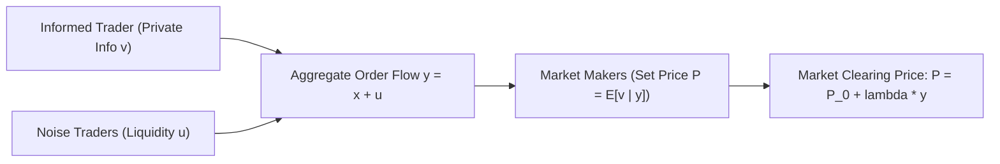
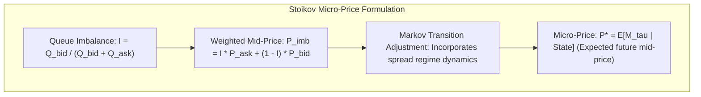

# Market Microstructure & Order Dynamics

> [!summary]
> The canonical mathematical and economic papers governing electronic financial markets: Albert Kyle's continuous auction and price impact model ($\lambda$), Glosten-Milgrom information asymmetry, Roll's effective spread, Rama Cont's Order Flow Imbalance (OFI), Sasha Stoikov's Micro-Price, Budish's analysis of the latency arms race, and the Avellaneda-Stoikov market-making framework.

---

## 1. Continuous Auctions and Informed Trader (Albert S. Kyle, 1985)

**Source:** [DOI](https://doi.org/10.2307/1913210)

### Foundational Market Model
Published in *Econometrica*, Albert Kyle modeled the interaction between three market participants:
1. **A Single Informed Trader**: Possesses private information about the true asset value $v \sim \mathcal{N}(p_0, \Sigma_0)$.
2. **Noise Traders (Uninformed)**: Submit random aggregate liquidity demand $u \sim \mathcal{N}(0, \sigma_u^2)$.
3. **Competitive Market Makers**: Observe only the net total order flow $y = x + u$ (cannot distinguish informed orders $x$ from noise $u$).



### Kyle's Lambda ($\lambda$) - The Measure of Market Depth
Market makers set prices as a linear function of order flow:

$$P = P_0 + \lambda y$$

$$\lambda = \frac{\text{Cov}(v, y)}{\text{Var}(y)} = \frac{\sqrt{\Sigma_0}}{2 \sigma_u}$$

- **Kyle's $\lambda$** measures **Price Impact (Illiquidity)**: The expected price change per unit of net order volume traded.
- When noise trading $\sigma_u$ is high, the informed trader's orders are camouflaged, resulting in smaller price impact ($\lambda$ is low). When noise trading is low, any large order moves the market substantially ($\lambda$ is high).

---

## 2. Information Asymmetry & The Bid-Ask Spread (Glosten & Milgrom, 1985)

**Source:** [DOI](https://doi.org/10.1016/0304-405X(85)90044-3)

### Why Does the Bid-Ask Spread Exist?
Before Glosten-Milgrom, economists assumed spreads existed only to cover administrative inventory costs. Glosten and Milgrom proved that **the spread is a dynamic response to Adverse Selection**:

```text
The Market Maker's Dilemma:
• If an uninformed trader hits your Bid or Ask: You earn the half-spread (Profit).
• If an informed trader hits your Bid or Ask: They trade because your price is STALE!
  They know the asset is worth MORE than your Ask or LESS than your Bid (Loss).
Conclusion: The Bid-Ask spread must be wide enough so that profits earned from
uninformed noise traders offset the systematic losses surrendered to informed traders.
```

---

## 3. Order Flow Imbalance (OFI) (Rama Cont et al., 2014)

**Source:** [open copy](https://arxiv.org/abs/1011.6402)

### High-Frequency Price Impact in Modern Limit Order Books
Published in *Journal of Financial Econometrics*, Cont, Kukanov, and Stoikov showed that price movements in electronic limit order books (LOB) over sub-second horizons are driven linearly by **Order Flow Imbalance (OFI)**:

$$\Delta P_k = \beta \cdot \text{OFI}_k + \epsilon_k$$

$$\text{OFI}_k = I_k^{\text{bid}} - I_k^{\text{ask}}$$

Where $I_k^{\text{bid}}$ captures the net change in available liquidity at the best bid quote across consecutive order book events:
- Increases when a limit buy order arrives at the best bid ($+$ size).
- Decreases when a limit buy is canceled or filled by a market sell ($-$ size).
- **Sub-Microsecond Alpha**: OFI provides algorithmic trading engines with an instantaneous, linear signal for predicting the direction of the next price tick.

---

## 4. The Micro-Price: A High-Frequency Estimator (Sasha Stoikov, 2018)

**Source:** [DOI](https://doi.org/10.1080/14697688.2018.1489139)

### Moving Beyond the Mid-Price
The traditional mid-price $M = \frac{P^A + P^B}{2}$ is naive because it completely ignores **queue depth**:
- If there are 10,000 shares bidding at $\$100.00$ and only 100 shares offered at $\$100.01$, the probability of the next trade crossing the spread and clearing the ask is over $95\%$. The "fair" price is much closer to $\$100.01$ than $\$100.005$.



---

## 5. The HFT Arms Race & Frequent Batch Auctions (Eric Budish et al., 2015)

**Source:** [open copy](https://www.cramton.umd.edu/papers2015-2019/budish-cramton-shim-hft-frequent-batch-auctions.pdf)

### The Flaw of the Continuous Double Auction (CDA)
Budish, Cramton, and Shim (University of Chicago) proved that modern financial markets operating as continuous double auctions create a socially wasteful **latency arms race**:
- Symmetrically correlated securities (e.g., S&P 500 ETF `SPY` in New York vs S&P 500 E-mini futures `ES` in Chicago) fluctuate continuously.
- When `ES` moves in Chicago, there is a race to snipe stale quotes in `SPY` in New York.
- Because CDA processes orders serially down to the nanosecond, whoever is **1 nanosecond faster** wins $100\%$ of the profit, forcing firms to spend billions on microwave towers and laser links.
- **The Solution**: **Frequent Batch Auctions (FBA)** - accumulate orders into discrete 100-millisecond batches and execute all orders at a single uniform clearing price, eliminating latency arbitrage.

---

## 6. Optimal High-Frequency Market Making (Avellaneda & Stoikov, 2008)

**Source:** [open copy](https://math.nyu.edu/~avellane/HighFrequencyTrading.pdf)

### Managing Inventory Risk in Limit Order Books
Avellaneda and Stoikov solved the optimal quoting problem for high-frequency market makers who face inventory risk (the risk of holding too much long or short stock during an adverse price trend):

$$r(s, q, t) = s - q \gamma \sigma^2 (T - t)$$

Where:
- $s$: Current market mid-price.
- $q$: Current inventory position ($q > 0$ long, $q < 0$ short).
- $\gamma$: Risk-aversion coefficient.
- $\sigma$: Price volatility.
- **Reservation (Indifference) Price $r$**:
  - When the market maker is long ($q > 0$), their reservation price shifts **downwards**. They quote an aggressive, cheaper Ask to shed inventory, and lower their Bid to avoid accumulating more shares.
  - When short ($q < 0$), their reservation price shifts **upwards**, quoting a higher Bid to buy back shares.

---

## Related Notes
- [[02-Lock-Free-and-Wait-Free-Algorithms|Lock-Free and Wait-Free Algorithms]]
- [[03-Kernel-Bypass-and-Sub-Microsecond-IO|Kernel-Bypass and Sub-Microsecond I/O]]
- [[../../14-Low-Latency-Systems/01 - Market & Microstructure Fundamentals/Order Book Dynamics and Queue Position|14-Low-Latency-Systems: Order Book Dynamics]]
- [[../../14-Low-Latency-Systems/Sources/The Microstructure of Financial Markets by Rama Cont and Sasha Stoikov|14-Low-Latency-Systems: Microstructure Source Summary]]
- [[README|Seminal Low-Latency Systems Papers MOC]]
