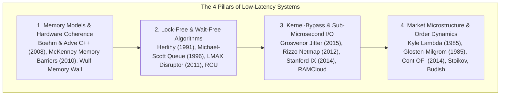

# Seminal Low-Latency Systems Papers Canon

> [!summary]
> The definitive research canon for quantitative developers, high-frequency trading (HFT) infrastructure architects, and ultra-low-latency systems engineers. Spanning C++ concurrency memory models, lock-free ring buffers, sub-microsecond kernel-bypass networking, and continuous financial market microstructure.

---

## The 4 Pillars of Low-Latency Systems Engineering

---

## Detailed Study Guides

### 1. [[01-Memory-Models-and-Hardware-Coherence|Memory Models & Hardware Coherence]]
- **Hans-J. Boehm & Sarita V. Adve (2008)** — *Foundations of the C++ Concurrency Memory Model*: Defining sequential consistency for data-race-free (SC-DRF) programs, memory orders (`memory_order_acquire`, `memory_order_release`, `memory_order_relaxed`), and compiler instruction reordering boundaries.
- **Paul E. McKenney (2010)** — *Memory Barriers: a Hardware View for Software Hackers*: CPU store buffers, store forwarding, invalidate queues, and hardware memory barrier instructions (`smp_mb()`, `mfence`).
- **Wm. A. Wulf & Sally A. McKee (1995)** — *Hitting the Memory Wall: Implications of the Obvious*: Mathematical projection of the exponential gap between processor clock speeds and DRAM latency.

### 2. [[02-Lock-Free-and-Wait-Free-Algorithms|Lock-Free & Wait-Free Algorithms]]
- **Maurice Herlihy (1991)** — *Wait-Free Synchronization*: The consensus hierarchy, proving that atomic registers and Test-and-Set cannot solve consensus for more than 2 processes, while Compare-and-Swap (CAS) has an infinite consensus number.
- **Maged M. Michael & Michael L. Scott (1996)** — *Simple, Fast, and Practical Non-Blocking Concurrent Queue Algorithms*: The canonical non-blocking MPMC FIFO queue (Michael-Scott Queue) using CAS.
- **R. Kent Treiber (1986)** — *Systems Programming: Coping with Parallelism*: The classic lock-free Treiber stack and the ABA problem.
- **Martin Thompson et al. (LMAX, 2011)** — *Disruptor: High Performance Alternative to Bounded Queues for Exchange Trading*: Pre-allocated circular ring buffers, zero-allocation steady state, cache line padding (`alignas(64)`), and mechanical sympathy.
- **Paul E. McKenney & John D. Slingwine (1998)** — *Read-Copy Update (RCU)*: Zero-overhead concurrent read access via deferred reclamation and grace periods.

### 3. [[03-Kernel-Bypass-and-Sub-Microsecond-IO|Kernel-Bypass & Sub-Microsecond I/O]]
- **Matthew P. Grosvenor et al. (Cambridge, 2015)** — *Jumpstarting the Network: Sub-Microsecond Network Jitter and Queuing Latency*: Exposing nanosecond queueing delays, PCIe bottlenecks, and packet serialization overheads.
- **Luigi Rizzo (2012)** — *Netmap: A Novel Framework for Fast Packet I/O*: Direct user-space ring buffer access bypassing the OS TCP/IP stack (precursor to modern DPDK and AF_XDP).
- **Adam Belay et al. (Stanford, 2014)** — *IX: A Protected Dataplane Operating System for High Throughput and Low Latency*: Hardware virtualization separating control planes from lock-free dataplane packet processing.
- **Stephen M. Rumble et al. (Stanford, 2011)** — *It's Time for Low Latency (RAMCloud)*: Proving that 5–10 microsecond RPCs fundamentally transform distributed storage architecture.
- **Patrick Stuedi et al. (IBM / Microsoft, 2014)** — *DaRPC: A Low-Latency Subsystem for RDMA-based RPCs*: Zero-copy remote direct memory access (RDMA) bypassing both host CPUs.

### 4. [[04-Market-Microstructure-and-Order-Dynamics|Market Microstructure & Order Dynamics]]
- **Albert S. Kyle (1985)** — *Continuous Auctions and Informed Trader*: Formulating **Kyle's $\lambda$** (price impact of order flow) and insider trading adverse selection.
- **Lawrence Glosten & Paul R. Milgrom (1985)** — *Bid, Ask and Transaction Prices in a Specialist Market*: Proving that the bid-ask spread is a dynamic response to **information asymmetry**.
- **Richard Roll (1984)** — *A Simple Implicit Measure of the Effective Bid-Ask Spread*: Measuring effective spread from serial covariance of price changes ($s = 2\sqrt{-\text{Cov}}$).
- **Rama Cont, Arseniy Kukanov, Sasha Stoikov (2014)** — *The Price Impact of Order Book Events*: Introducing **Order Flow Imbalance (OFI)** as a linear predictor of short-term price direction.
- **Sasha Stoikov (2018)** — *The Micro-Price: A High-Frequency Estimator of Future Prices*: Volume-weighted micro-price incorporating order queue depth and Markov state transitions.
- **Eric Budish, Peter Cramton, John Shim (2015)** — *The High-Frequency Trading Arms Race*: Demonstrating why continuous double auctions create latency arbitrage and proposing **Frequent Batch Auctions (FBA)**.
- **Marco Avellaneda & Sasha Stoikov (2008)** — *High-Frequency Trading in a Limit Order Book*: Optimal inventory-risk bid/ask quoting strategies.

---

## Related Notes
- [[../README|Technical Whitepapers Master MOC]]
- [[../09-Seminal-Computer-Science-Papers/README|Seminal Computer Science Papers MOC]]
- [[../../14-Low-Latency-Systems/14 - Industry Map & Canon/Canonical Books, Papers, and Talks Index|14-Low-Latency-Systems: Canonical Literature]]
- [[../../14-Low-Latency-Systems/08 - Low-Latency Programming/Lock-Free SPSC Ring Buffer Design|14-Low-Latency-Systems: Lock-Free SPSC Ring Buffer]]
