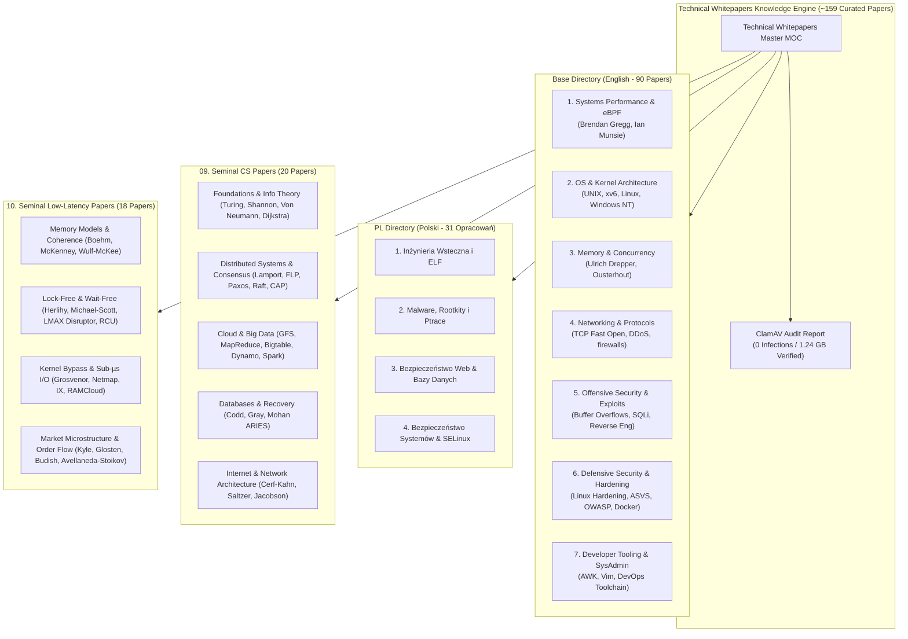

# Technical Whitepapers Archive

> **For hackers, pentesters, system administrators, programmers, and security researchers.**
> A curated canon of seminal papers, performance treatises, exploit analysis, kernel documentation, and defensive hardening benchmarks.

---

## Executive Overview & Archive Provenance

This archive integrates the high-value technical whitepaper collection across two primary editions:
- **`base` (English Edition)**: 90 foundational whitepapers (~223 MB) covering Linux performance superpowers (Brendan Gregg), OS kernel internals (Linux, Windows NT, xv6), x86 memory hierarchy (Ulrich Drepper), high-speed TCP/IP networking, binary exploitation, and production system hardening.
- **`pl` (Polish Edition)**: 31 specialized technical guides and research papers (~112 MB) covering reverse engineering, shellcode evolution, Linux rootkits and ptrace exploitation, web application security (Michał Sajdak), and SELinux mandatory access control.
- **`09-Seminal-Computer-Science-Papers`**: 20 foundational academic papers spanning computability, information theory, distributed consensus, big data, relational databases, and internet architecture.
- **`10-Seminal-Low-Latency-Systems-Papers`**: 18 critical papers for low-latency and HFT systems engineering covering C++ memory models, lock-free/wait-free algorithms, kernel-bypass I/O, and market microstructure dynamics.

### Integrity & Antivirus Verification
The complete archive has been audited and verified via ClamAV with **zero infected files** across all directories and payloads:
- **Full Report**: [[ClamAV-Audit-Report|ClamAV Security Audit & Verification Report]]
- **Scan Stats**: 6,784,116 signatures, 201 directories, 508 scanned files, 1.24 GB payload inspected, **0 infected files**.

---

## Direct Catalogs & Fast Indexes

- **[[base/Index-Base-English-Whitepapers|Base Directory Index (English — 90 Papers)]]**: Complete searchable table of all English whitepapers with authors, years, domains, and reference notes.
- **[[pl/Index-Polish-Whitepapers|Polish Directory Index (Polski — 31 Opracowań)]]**: Pełny katalog polskich opracowań technicznych z podziałem na inżynierię wsteczną, malware, web i systemy.
- **[[09-Seminal-Computer-Science-Papers/README|Seminal Computer Science Papers Index (20 Foundational Papers)]]**: Master curriculum of Turing, Shannon, Lamport, Gray, Mohan, Codd, Cerf-Kahn, and Dean/Ghemawat.
- **[[10-Seminal-Low-Latency-Systems-Papers/README|Seminal Low-Latency Systems Papers Index (18 Systems & HFT Papers)]]**: Master curriculum of C++ memory models, wait-free algorithms, kernel bypass, and high-frequency market microstructure.

---

## Curated Technical Deep-Dive Guides

### 1. [[01-Systems-Performance-and-Tracing/README|Systems Performance, eBPF & Tracing]]
Mastering Linux kernel observability, hardware performance counters, and non-invasive profiling:
- [[01-Systems-Performance-and-Tracing/Brendan-Gregg-Performance-Canon|Brendan Gregg Performance Canon]]: 14 seminal papers including *BPF: Tracing and More*, *Linux 4.x Performance Using BPF Superpowers*, *The USE Method*, *Performance Checklists for SREs*, and *Linux Profiling at Netflix*.
- [[01-Systems-Performance-and-Tracing/Linux-Tracing-and-Instrumentation|Linux Tracing & Instrumentation Guide]]: Ian Munsie (*Linux Instrumentation*), Jörg Zinke (*System call tracing overhead*), and Harald König (*Use "strace" to Understand Your Shell*).

### 2. [[02-Operating-Systems-and-Kernels/README|Operating Systems & Kernel Internals]]
Understanding the internal mechanics of modern kernels:
- [[02-Operating-Systems-and-Kernels/Unix-and-Linux-Kernel-Foundations|UNIX and Linux Kernel Foundations]]: Dennis Ritchie & Ken Thompson (*The UNIX Time-Sharing System*, 1974), Michael K. Johnson (*Linux Kernel Hackers' Guide*), Rusty Russell (*Unreliable Guide To Hacking The Linux Kernel*), and Lozi et al. (*The Linux Scheduler: a Decade of Wasted Cores*).
- [[02-Operating-Systems-and-Kernels/OS-From-Scratch-and-Teaching-Kernels|Teaching Operating Systems]]: MIT's *xv6 Unix-like teaching OS* (Cox, Kaashoek, Morris) and Nick Blundell's *Writing a Simple Operating System — from Scratch*.
- [[02-Operating-Systems-and-Kernels/Windows-NT-Internals-Architecture|Windows NT Internals & Architecture]]: David Cutler (*Windows NT Alerts Design Note*, 1989), Mark Lucovsky (*Windows Odyssey*), David B. Probert's 10-part *Windows Kernel Internals* curriculum (Traps, Virtual Memory, Cache Manager, I/O, LPC, NTFS, Registry, Object Manager, Synchronization), WinDbg guides, and Alex Ionescu (*The Linux Kernel Hidden Inside Windows 10*).

### 3. [[03-Memory-Architecture-and-Concurrency/README|Memory Architecture, CPU Microarchitecture & Concurrency]]
Bridging software algorithms with CPU hardware memory hierarchies:
- [[03-Memory-Architecture-and-Concurrency/Ulrich-Drepper-Memory-Architecture|Ulrich Drepper — What Every Programmer Should Know About Memory]]: Complete architectural analysis of L1/L2/L3 caches, line associativity, cache indexing, NUMA access penalties, TLBs, and MESI cache coherence.
- [[03-Memory-Architecture-and-Concurrency/Concurrency-and-Threading-Debates|Concurrency & Threading Debates]]: John Ousterhout (*Why Threads Are A Bad Idea*), Elaine Cheong & Fred Reiss (*Virtual Threads*).
- [[03-Memory-Architecture-and-Concurrency/Data-Structures-and-Memory-Opt|Data Structures & Memory Optimization]]: Manegold et al. (*What Happens During a Join: CPU and Memory Effects*), Lee & Martel (*When to use splay trees*), Klaus Mueller (*Using CUDA in Practice*).

### 4. [[04-Networking-and-Protocols/README|Networking, TCP/IP & Protocols]]
Low-latency communication and network diagnostics:
- [[04-Networking-and-Protocols/High-Performance-TCP-and-Networking|High-Performance TCP & Networking]]: Radhakrishnan et al. (*TCP Fast Open*), Van Jacobson & Bob Felderman (*Speeding up Networking*).
- [[04-Networking-and-Protocols/Network-Diagnostics-and-DDoS|Network Diagnostics, DDoS & Firewalls]]: Jason Zurawski (*Using TCPDump, TCPTrace, & XPlot to Debug Network Problems*), Elvir Kuric (*Open source firewall tools Iptables and PF*), *Network Security Hardening Guide v1.2*, and Tzvetanov (*DDoS Handbook & Tutorial*).

### 5. [[05-Offensive-Security-and-Exploitation/README|Offensive Security, Exploitation & Vulnerability Research]]
Understanding binary corruption, web injections, and adversary methodologies:
- [[05-Offensive-Security-and-Exploitation/Binary-Exploitation-and-Reverse-Eng|Binary Exploitation & Reverse Engineering]]: Dennis Yurichev (*Reverse Engineering for Beginners*), Terry Bruce Gillette (*Buffer Overflow Condition*), Buchlovsky & Butcher (*Buffer overflow vulnerabilities*), Konstantin Rozinov (*PE File Infection Techniques*), and Felix Wilhelm (*Tracing Privileged Memory Accesses*).
- [[05-Offensive-Security-and-Exploitation/Database-Exploitation-and-SQL-Injection|Database Exploitation & SQL Injection]]: Chris Anley (*Advanced SQL Injection In SQL Server Applications*), Ofer Maor & Amichai Shulman (*Blindfolded SQL Injection*), Kevin Spett (*Blind SQL Injection*), and Cesar Cerrudo (*Manipulating Microsoft SQL Server*).
- [[05-Offensive-Security-and-Exploitation/Vulnerability-Research-and-Web-Exploits|Vulnerability Research & Web Exploits]]: Simon Egli (*Bypassing Same Origin Policy*), Cedric Halbronn (*The Return of Robin Hood vs Cisco ASA*), Bond & Zieliński (*Decimalisation Table Attacks for PIN Cracking*), and Ferreira (*Checklist for Penetration Testing*).

### 6. [[06-Defensive-Security-and-Hardening/README|Defensive Security, OS Hardening & AppSec]]
Building resilient, verified systems and zero-trust infrastructure:
- [[06-Defensive-Security-and-Hardening/Linux-Operating-System-Hardening|Linux Operating System Hardening]]: Michael Boelen's security trilogy (*Linux Hardening*, *Linux Systems Compromised*, *Linux Security for Developers*), Charalambous Glafkos (*Securing & Hardening Linux*), Martin Jõgi (*Linux Hardening Standard*), Yves-Alexis Perez (*Hardened kernels for everyone*), and Luis Franco Marin (*SELinux Policy Management*).
- [[06-Defensive-Security-and-Hardening/Container-and-Microservice-Security|Container & Microservice Security]]: Aaron Grattafiori (*Docker and High Security Microservices*), *LXC, Docker, Security*, and Pati Gallardo (*Linux Security and the Chromium Sandbox*).
- [[06-Defensive-Security-and-Hardening/Application-and-Infrastructure-Sec|Application & Infrastructure Security]]: OWASP *Application Security Verification Standard (ASVS 3.0.1)*, *OWASP Testing Guide v4*, Ralph Durkee (*Intro to AppSec & OWASP Top 10*), Robert Morella (*Auditing Web Applications*), Ryan Barnett (*Apache Security Benchmark*), and Robert Bernier (*Total security in a PostgreSQL database*).

### 7. [[07-Polish-Technical-Papers-pl/README|Polish Technical Whitepapers (pl)]]
Polska biblioteka zaawansowanych publikacji technicznych:
- [[07-Polish-Technical-Papers-pl/Inzynieria-Wsteczna-i-Analiza-Kodu|Inżynieria Wsteczna i Analiza Kodu Wykonywalnego]]: Wojciech Warpechowski, Marek Janiczek (analiza dynamiczna ELF), Andrzej Stasiak (tryb chroniony x86), Itzik Kotler (ewolucja kodów powłoki), Michał Piotrowski (polimorficzny szelkod).
- [[07-Polish-Technical-Papers-pl/Malware-Rootkity-i-Zagrozenia|Malware, Rootkity i Ptrace]]: Stefan Klaas (rootkity i ptrace), Mariusz Burdach (własny rootkit w GNU/Linuksie), Rubén Santamarta (analiza malware), opracowania na temat wirusów i robaków sieciowych.
- [[07-Polish-Technical-Papers-pl/Bezpieczenstwo-Web-i-Baz-Danych|Bezpieczeństwo Aplikacji WWW i Baz Danych]]: Czteroczęściowy cykl Michała Sajdaka (Sekurak/Niebezpiecznik), Leszek Miś (*Aplikacje webowe na celowniku*), Kluge et al. (SQL injection), Kenny Kerr (kodowanie defensywne), Michał Piotrowski (*Niebezpieczne Google*).
- [[07-Polish-Technical-Papers-pl/Bezpieczenstwo-Systemow-i-Sieci|Bezpieczeństwo Systemów, Sieci i Administracja]]: Robert Jaroszuk & Brodecki/Sasak (SELinux i obowiązkowa kontrola dostępu), Leszek Miś (nowości RHEL6), Marcin Żurakowski (obrona DoS), Adam Augustyn (karty elektroniczne PKI), Ligęza & Szpyrka (administracja PostgreSQL).

### 8. [[08-Developer-Tooling-and-Foundations/README|Developer Tooling & SysAdmin Foundations]]
- [[08-Developer-Tooling-and-Foundations/Developer-Tooling-and-SysAdmin|Developer Tooling & SysAdmin Practices]]: Alfred Aho, Brian Kernighan, Peter Weinberg (*The AWK Programming Language*), Vincent Jousse (*Vim for humans*), UpGuard (*DevOps Toolchain*), and *SysAdmin Magazine: Tools & Tips*.

### 9. [[09-Seminal-Computer-Science-Papers/README|Seminal Computer Science Papers]]
The 20 papers that constructed modern computing, distributed systems, big data, and networking:
- [[09-Seminal-Computer-Science-Papers/01-Foundations-and-Information-Theory|Foundations & Information Theory]]: Alan Turing (Computable Numbers, 1936), Claude Shannon (Mathematical Theory of Communication, 1948), John von Neumann (EDVAC First Draft, 1945), Edsger W. Dijkstra (Go To Statement Considered Harmful, 1968).
- [[09-Seminal-Computer-Science-Papers/02-Distributed-Systems-and-Consensus|Distributed Systems & Consensus]]: Leslie Lamport (Time, Clocks and Ordering, 1978; Byzantine Generals, 1982; Paxos Made Simple, 1998/2001), Fischer-Lynch-Paterson (FLP Impossibility, 1985), Ongaro & Ousterhout (Raft In Search of Understandable Consensus, 2014), Eric Brewer & Seth Gilbert (CAP Theorem, 2000/2002).
- [[09-Seminal-Computer-Science-Papers/03-Cloud-Infrastructure-and-Big-Data|Cloud Infrastructure & Big Data]]: Sanjay Ghemawat & Jeff Dean (Google File System, 2003; MapReduce, 2004; Bigtable, 2006), Giuseppe DeCandia et al. (Amazon Dynamo, 2007), Matei Zaharia et al. (Resilient Distributed Datasets / Apache Spark, 2012).
- [[09-Seminal-Computer-Science-Papers/04-Databases-and-Transaction-Processing|Databases & Transaction Processing]]: Edgar F. Codd (Relational Model for Large Shared Data Banks, 1970), Jim Gray et al. (Granularity of Locks and Degrees of Consistency, 1976), C. Mohan et al. (ARIES Recovery Algorithm, 1992).
- [[09-Seminal-Computer-Science-Papers/05-Internet-Architecture-and-End-to-End|Internet Architecture & End-to-End]]: Vint Cerf & Robert Kahn (TCP/IP Packet Network Intercommunication, 1974), Saltzer, Reed & Clark (End-to-End Arguments in System Design, 1984), Van Jacobson (Congestion Avoidance and Control / AIMD, 1988), Butler Lampson (Hints for Computer System Design, 1983).

### 10. [[10-Seminal-Low-Latency-Systems-Papers/README|Seminal Low-Latency Systems Papers]]
The 18 architectural, algorithmic, and financial microstructure papers every low-latency engineer must master:
- [[10-Seminal-Low-Latency-Systems-Papers/01-Memory-Models-and-Hardware-Coherence|Memory Models & Hardware Coherence]]: Hans-J. Boehm & Sarita V. Adve (Foundations of the C++ Memory Model, 2008), Paul E. McKenney (Memory Barriers: a Hardware View for Software Hackers, 2010), Wm. A. Wulf & Sally A. McKee (Hitting the Memory Wall, 1995).
- [[10-Seminal-Low-Latency-Systems-Papers/02-Lock-Free-and-Wait-Free-Algorithms|Lock-Free & Wait-Free Algorithms]]: Maurice Herlihy (Wait-Free Synchronization, 1991), Maged M. Michael & Michael L. Scott (Simple, Fast, and Practical Non-Blocking Concurrent Queue, 1996), R. Kent Treiber (Systems Programming: Coping with Parallelism / Treiber Stack, 1986), Martin Thompson et al. (The LMAX Disruptor Architecture, 2011), Paul E. McKenney & John Slingwine (Read-Copy Update / RCU, 1998).
- [[10-Seminal-Low-Latency-Systems-Papers/03-Kernel-Bypass-and-Sub-Microsecond-IO|Kernel Bypass & Sub-Microsecond I/O]]: Matthew P. Grosvenor et al. (Jumpstarting the Cloud: Sub-Microsecond Jitter, 2015), Luigi Rizzo (Netmap: a Novel Framework for Fast Packet I/O, 2012), Adam Belay et al. (IX: A Protected Data-Plane Operating System, 2014), Stephen M. Rumble et al. (It's Time for Low Latency / Stanford RAMCloud, 2011), Anuj Kalia et al. (Using RDMA Efficiently for Low-Latency RPC / DaRPC, 2014).
- [[10-Seminal-Low-Latency-Systems-Papers/04-Market-Microstructure-and-Order-Dynamics|Market Microstructure & Order Dynamics]]: Albert S. Kyle (Continuous Auctions and Informed Trader / Kyle's Lambda, 1985), Lawrence R. Glosten & Paul R. Milgrom (Bid, Ask and Transaction Prices in Adverse Selection, 1985), Richard Roll (A Simple Implicit Measure of the Effective Bid-Ask Spread, 1984), Rama Cont et al. (Price Dynamics in a Markovian Limit Order Book & Order Flow Imbalance, 2010/2014), Sasha Stoikov (The Micro-Price: a High-Frequency Estimator of Future Prices, 2018), Eric Budish et al. (The High-Frequency Trading Arms Race: Frequent Batch Auctions, 2015), Marco Avellaneda & Sasha Stoikov (High-Frequency Trading in a Limit Order Book, 2008).

---

## Recommended Study Pathways

### Pathway A: High-Performance Systems & SRE Engineer
1. **Ulrich Drepper** — [[03-Memory-Architecture-and-Concurrency/Ulrich-Drepper-Memory-Architecture|What Every Programmer Should Know About Memory]]
2. **Brendan Gregg** — [[01-Systems-Performance-and-Tracing/Brendan-Gregg-Performance-Canon|The USE Method]] & [[01-Systems-Performance-and-Tracing/Brendan-Gregg-Performance-Canon|Performance Checklists for SREs]]
3. **Brendan Gregg** — [[01-Systems-Performance-and-Tracing/Brendan-Gregg-Performance-Canon|BPF: Tracing and More]] & [[01-Systems-Performance-and-Tracing/Brendan-Gregg-Performance-Canon|Linux Systems Performance]]
4. **Lozi et al.** — [[02-Operating-Systems-and-Kernels/Unix-and-Linux-Kernel-Foundations|The Linux Scheduler: a Decade of Wasted Cores]]
5. **Radhakrishnan et al.** — [[04-Networking-and-Protocols/High-Performance-TCP-and-Networking|TCP Fast Open]]

### Pathway B: Security Engineer & Penetration Tester
1. **Dennis Yurichev** — [[05-Offensive-Security-and-Exploitation/Binary-Exploitation-and-Reverse-Eng|Reverse Engineering for Beginners]]
2. **Terry Bruce Gillette** — [[05-Offensive-Security-and-Exploitation/Binary-Exploitation-and-Reverse-Eng|A Unique Examination of the Buffer Overflow Condition]]
3. **Chris Anley & Kevin Spett** — [[05-Offensive-Security-and-Exploitation/Database-Exploitation-and-SQL-Injection|Advanced & Blind SQL Injection]]
4. **OWASP Foundation** — [[06-Defensive-Security-and-Hardening/Application-and-Infrastructure-Sec|Application Security Verification Standard (ASVS 3.0.1)]]
5. **Michael Boelen** — [[06-Defensive-Security-and-Hardening/Linux-Operating-System-Hardening|Linux Hardening & Systems Compromised]]

### Pathway C: Operating System & Kernel Developer
1. **Ritchie & Thompson** — [[02-Operating-Systems-and-Kernels/Unix-and-Linux-Kernel-Foundations|The UNIX Time-Sharing System (1974)]]
2. **Cox, Kaashoek, Morris** — [[02-Operating-Systems-and-Kernels/OS-From-Scratch-and-Teaching-Kernels|xv6: a simple, Unix-like teaching operating system]]
3. **Nick Blundell** — [[02-Operating-Systems-and-Kernels/OS-From-Scratch-and-Teaching-Kernels|Writing a Simple Operating System — from Scratch]]
4. **David B. Probert** — [[02-Operating-Systems-and-Kernels/Windows-NT-Internals-Architecture|Windows Kernel Internals (Traps, Memory, I/O, Cache)]]
5. **Mariusz Burdach & Stefan Klaas** — [[07-Polish-Technical-Papers-pl/Malware-Rootkity-i-Zagrozenia|Kernel Rootkits & Ptrace Injection]]

### Pathway D: Distributed Systems Architect & Cloud Infrastructure
1. **Leslie Lamport** — [[09-Seminal-Computer-Science-Papers/02-Distributed-Systems-and-Consensus|Time, Clocks, and the Ordering of Events in a Distributed System (1978)]]
2. **Fischer, Lynch, Paterson** — [[09-Seminal-Computer-Science-Papers/02-Distributed-Systems-and-Consensus|FLP Impossibility of Distributed Consensus (1985)]]
3. **Ongaro & Ousterhout** — [[09-Seminal-Computer-Science-Papers/02-Distributed-Systems-and-Consensus|In Search of an Understandable Consensus Algorithm (Raft, 2014)]]
4. **Sanjay Ghemawat & Jeff Dean** — [[09-Seminal-Computer-Science-Papers/03-Cloud-Infrastructure-and-Big-Data|The Google File System (2003)]] & [[09-Seminal-Computer-Science-Papers/03-Cloud-Infrastructure-and-Big-Data|MapReduce (2004)]]
5. **Giuseppe DeCandia et al.** — [[09-Seminal-Computer-Science-Papers/03-Cloud-Infrastructure-and-Big-Data|Dynamo: Amazon's Highly Available Key-value Store (2007)]]
6. **C. Mohan et al.** — [[09-Seminal-Computer-Science-Papers/04-Databases-and-Transaction-Processing|ARIES: A Transaction Recovery Method (1992)]]

### Pathway E: Ultra-Low-Latency & High-Frequency Trading Engineer
1. **Hans Boehm & Sarita Adve** — [[10-Seminal-Low-Latency-Systems-Papers/01-Memory-Models-and-Hardware-Coherence|Foundations of the C++ Memory Model (2008)]]
2. **Paul E. McKenney** — [[10-Seminal-Low-Latency-Systems-Papers/01-Memory-Models-and-Hardware-Coherence|Memory Barriers: a Hardware View for Software Hackers (2010)]]
3. **Maurice Herlihy** — [[10-Seminal-Low-Latency-Systems-Papers/02-Lock-Free-and-Wait-Free-Algorithms|Wait-Free Synchronization (1991)]]
4. **Martin Thompson et al.** — [[10-Seminal-Low-Latency-Systems-Papers/02-Lock-Free-and-Wait-Free-Algorithms|The LMAX Disruptor Architecture (2011)]]
5. **Luigi Rizzo & Adam Belay** — [[10-Seminal-Low-Latency-Systems-Papers/03-Kernel-Bypass-and-Sub-Microsecond-IO|Netmap (2012)]] & [[10-Seminal-Low-Latency-Systems-Papers/03-Kernel-Bypass-and-Sub-Microsecond-IO|IX Protected Data-Plane OS (2014)]]
6. **Eric Budish et al.** — [[10-Seminal-Low-Latency-Systems-Papers/04-Market-Microstructure-and-Order-Dynamics|The High-Frequency Trading Arms Race: Frequent Batch Auctions (2015)]]
7. **Avellaneda & Stoikov** — [[10-Seminal-Low-Latency-Systems-Papers/04-Market-Microstructure-and-Order-Dynamics|High-Frequency Trading in a Limit Order Book (2008)]]

---

## Vault Integration & Cross-Links
- **[[14-Low-Latency-Systems/00 Home|14-Low-Latency-Systems]]**: Deeply cross-linked with Module 10 (Hardware Mechanical Sympathy, Lock-Free Ring Buffers, Kernel Bypass, Order Book Architecture, and Microstructure Sources).
- **[[../11-Security-And-Cryptography/README|11-Security-And-Cryptography]]**: Connected to Offensive Exploitation, Web Security, and Hardening Guides.
- **[[../12-Performance-Engineering/README|12-Performance-Engineering]]**: Connected to Brendan Gregg Tracing and Ulrich Drepper Memory Architectures.
- **[[../01-CS-Foundations/Operating-Systems/README|01-CS-Foundations / Operating-Systems]]**: Connected to xv6, UNIX, and Kernel Scheduling foundations.
- **[[../INDEX|Repository Master Index (INDEX.md)]]**: Referenced under Phase 4: Production Engineering.
