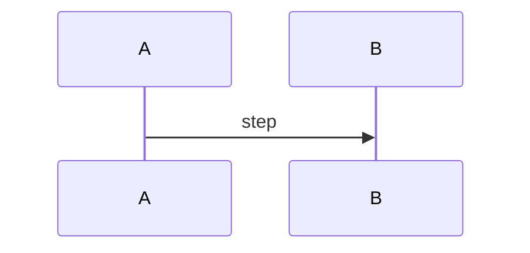

# <% tp.file.title.replace(/-/g, " ") %>

> [!summary] TL;DR
> Three to five sentences: the problem, the key idea, and why it still matters.

## Learning outcomes

- 

## Motivation and the problem

## Core concepts

### Concept heading (one per row in _coverage.csv, exact text)

## Mechanisms step by step

## Worked examples

## Comparison

| Design | Strength | Weakness |
| --- | --- | --- |

## Paper deep dives

## Modern descendants

## Pitfalls and exam traps

> [!warning]
> 

## Practice

> [!question]- Question (concepts: Lxxx-NN)
> Answer.

## Lab

## Further reading
